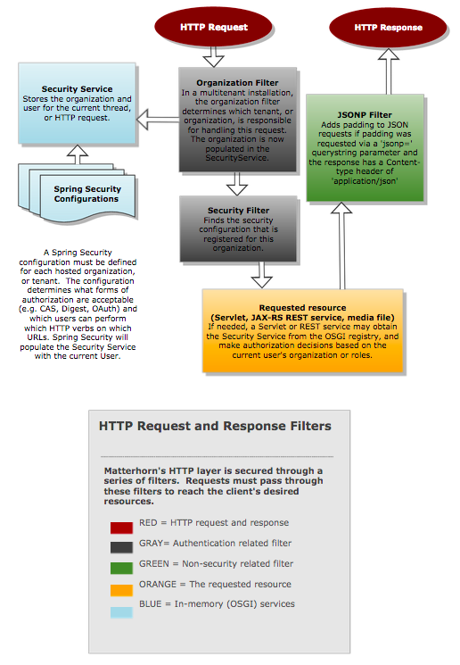

# Security Configuration

This document will help you configure the Matterhorn security policy.

## Introduction
Matterhorn service endpoints and user interfaces are secured by default using a set of servlet filters. The following diagram illustrates the flow of an HTTP request and response through these filters.

The Spring Security filters used here are very powerful, but are also somewhat complicated. Please familiarize yourself with the basic concepts and vocabulary described in the Spring Security documentation, then edit the xml files in <felix_home>/etc/security, as described below.

## Configure Access
To configure access roles and URL patterns for a tenant, modify `<felix_home>/etc/security/{{tenant_identifier.xml}}`. If you are not hosting multiple tenants on your Matterhorn server or cluster, all configuration should be done in mh_default_org.xml.

Some examples:

    <!-- Allow anonymous access to the welcome.html URLs -->
    <sec:intercept-url pattern='/welcome.html' access='ROLE_ANONYMOUS,ROLE_USER'/>
     
    <!-- Allow anonymous GET to the search service, but not POST or PUT -->
    <sec:intercept-url pattern='/search/**' method="GET" access='ROLE_ANONYMOUS,ROLE_USER' />
     
    <!-- Allow users with the admin role to do anything -->
    <sec:intercept-url pattern='/**' access='ROLE_ADMIN'/>

## Authentication Provider

Matterhorn specifies an AuthenticationProvider by default, using a UserDetailService that is obtained from the OSGI service registry.

You can use this simple provider as is, loading users into the mh_user and mh_role database tables, and specifying an administrative username and password in config.properties:

    org.opencastproject.security.digest.user=matterhorn_system_account
    org.opencastproject.security.digest.pass=CHANGE_ME

The set of user and role providers can be configured. If you do not want to keep users and passwords in Matterhorn's database, you can replace the JpaUserAndRoleProvider with the LdapUserProvider by replacing the matterhorn-userdirectory-jpa jar with the matterhorn-userdirectory-ldap jar.

### Adding Users to the Matterhorn Database
Additional users can be created by adding a username, organization and password hash to the mh_user table in the Matterhorn database. The default hash method is MD5 and the password must be salted with the username in curly braces.

**At the moment, there is no graphical user interface for this task. It has to be done in the database.**
 
Example: Adding Garfield with the password 'monday' (in MySQL)

    INSERT INTO `matterhorn`.`mh_user` (`username`, `organization`, `password`) VALUES ('garfield', 'mh_default_org', MD5('monday{garfield}'));

In the next step roles for the newly created user can be added to the mh_role table. After that the created user and role id can be added to the mh_user_role table. Here we set ROLE_USER for Garfield:

    INSERT INTO `matterhorn`.`mh_role` (`organization`, `name`, `description`) VALUES ('mh_default_org', 'ROLE_USER', 'The user role');
    INSERT INTO `matterhorn`.`mh_user_role` (`user_id`, `role_id`) VALUES ('220', '221');

** Note that you must set the value of the organization field to the organization ID specified in one of the etc/load/org.opencast.organization-<organization_name>.cfg files. In a default installation this is 'mh_default_org'.**
 
## Further Authentication Configuration

[Configure Central Authentication Service (CAS)](security.cas.md)
